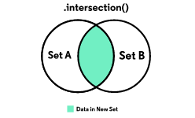

# Learning Swift and SwiftUI

Created: April 18, 2023 6:21 PM

# Syntax basics, data types and unique language features

[https://www.codecademy.com/learn/learn-swift](https://www.codecademy.com/learn/learn-swift)

Data types are similar to that of Typescript just more specific with numerical values such as Int and Float

## let vs var

Confusingly compared to Typescript, let is a constant in Swift, var is mutable

```swift
// let is a constant
let favouriteNumber: Int = 5

// var is mutable
var age: Int = 32
```

## String interpolation

```swift
// TS interpolation vs swift interpolation
console.log(`I am ${age} years old`) vs print("I am \(age) years old")
```

```swift
print("I am \(age) years old and my favourite number is \(favouriteNumber)!")
```

# Conditionals & logic

## If statements

if statements are pretty standard but do not require the parentheses

```swift
if statement == true {
	print("Statement is true")
}
```

## if - let statement and optionals

If accessing a value inside a dictionary using subscript syntax, it’ll return an optional. You can unwrap the value with `!` or use if-let to ensure the value exists and handle if it doesn’t

```swift
var names: [String: String] = [
	"Charles": "Charlie",
	"David": "Dave",
	"Edward": "Ed"
]

var alpha = names["Charles"]

print("The alpha male is called \(alpha)")
// The alpha male is called Optional("Charlie")

// To unwrap the value when you know it exists, you can simply use
var alphaButUnwrapped = names["Charles"]!

print(alphaButUnwrapped)
// Charlie

// Using if - let to ensure it exists
if let senileOldMan = names["Edward"] {
	print("\(senileOldMan) is the senile one")
	// Ed is the senile one
}

```

## Switch statement

switch statements follow the same idea compared to typescript

```swift
let number: Int = 3

switch number {
case 1:
    print("Number is 1")
case 2:
    print("Number is 2")
default:
    print("Number is not 1 or 2")
}
```

## Switch statement compound cases

Instead of listing a number of cases like Typescript, you can just separate each case with a comma

```swift
let day = "Saturday"

switch day {
	case "Saturday", "Sunday":
	    print("It's the weekend!")
	default:
	    print("It's a weekday.")
	}

```

## Switch statement interval matching

switch statements also let you do interval matching which is nice

```swift
let year = 1941

switch year {
	case 1914...1918:
	    print("World War I")
	case 1939...1945:
	    print("World War II")
	default:
	    print("No war")
	}

```

## Where clause in switch statements

When you want to test additional configurations against an expression

```swift
let num = 7

switch num {
  case let x where x % 2 == 0:
    print("\(num) is even")
  case let x where x % 2 == 1:
    print("\(num) is odd")
  default:
    print("\(num) is invalid")
}
```

# Loops

## for-in loop

```swift
for age in 1...32 {
  print("I have been \(age) before")
}
```

## stride

stride is pretty much the replacement of a for loop you’d find in other languages. Cleaner though. 

```swift
for num in stride(from: 3, to: 0, by: -1) {
	print(num)
}
```

## iterating over strings

```swift
var aString = "Axrxsenxxxaxl xfoxxoxtbaxxlxl cxxlxuxb"

for char in aString {
  if char != "x" {
    print(char)
  }
}
// Arsenal football club
```

# Arrays

To create an empty array of a certain type, we can use the initialiser syntax

```swift
var scores = [Int]()
```

## Initialise array literal with values

```swift
var scores: [Int] = [800, 1200, 1500]
```

The length of the array uses `.count` rather than .length you’d find in most other languages

```swift
var scores: [Int] = [500, 750, 1000, 1250]
print(scores.count)
```

## Adding to an array

```swift
var names: [String] = ["Fred", "Bob", "Ted"];

// Add to array using .append
names.append("Dave");

// Add to an array using +=
names += ["Graham"]

// Inserting to a specific index
var nums: [Int] = [1, 2, 4, 5, 6];
nums.insert(3, at: 2)

print(nums) // 1 2 3 4 5 6
```

## Removing from an array

Removing from a specific index

```swift
var nums: [Int] = [1, 2, 3, 3, 4, 5, 6];

nums.remove(at: 3)

print(nums) // 1 2 3 4 5 6
```

# Sets

Creating a set

```swift
var consonants = Set<Character>()
var vowels: Set = ["A", "E", "I", "O", "U"]
```

Again checking how many values in the set is done with `.count` and can check if it is empty using `.empty`

```swift
var consonants = Set<Character>()
var vowels: Set = ["A", "E", "I", "O", "U"]

print(consonants.isEmpty) // true
print(vowels.count) // 5
```

Inserting into a set

```swift
var vowels: Set = ["A", "I", "O", "U"]
vowels.insert("E")
```

Removing from a set

```swift
var planets: Set = ["Earth", "Jupiter", "Mars", "Neptune", "Saturn", "Venus", "Uranus", "Mercury", "Pluto"]

planets.remove("Pluto")

planets.removeAll()
```

Set operations are really handy to find data that belongs in two sets, or the difference between sets, as an example.

## intersection



```swift
var swim: Set = ["Turtles", "Ducks", "Puffins", "Shark"]

var fly: Set = ["Humming birds", "Bats", "Ducks", "Puffins"]

print(swim.intersection(fly)) // ["Ducks", "Puffins"]
```

## union


```swift
var consonants: Set = ["B", "C", "D", "F", "G", "H", "J", "K", "L", "M", "N", "P", "Q", "R", "S", "T", "V", "W", "X", "Y", "Z"]

var vowels: Set = ["A", "E", "I", "O", "U"]

print(consonants.union(vowels)) // The whole alphabet
```

## symmetric difference


```swift
var plWinners: Set = ["Manchester United", "Man City", "Liverpool"]

var clWinners: Set = ["Manchester United", "Liverpool", "Nottingham Forest"]

print(plWinners.symmetricDifference(clWinners); // ["Man City", "Nottingham Forest"]
```

# Dictionaries

Creating an empty dictionary can be done in two ways

```swift
var employeeAges: [String: Int] = [:]

var studentAges = [String: Int]()
```

Dictionaries are similar to that of JSON objects, but use square brackets to wrap them

```swift
var arsenalPlayers: [String: Int] = [
	"Bukayo Saka": 7,
	"Martin Ødegaard": 8,
	"Gabriel Jesus": 9,
]

// Can also use type inference
var invinciblesArsenalPlayers = [
	"Robert Pires": 7,
	"Freddie Ljungberg": 8,
	"Dennis Bergkamp": 10
]
```

## Adding elements

Can simply add items using square bracket notation like JS

```swift
var arsenalPlayers = [
	"Bukayo Saka": 7,
	"Martin Ødegaard": 8,
	"Gabriel Jesus": 9,
]

arsenalPlayers["Emile Smith Rowe"] = 10
```

## Updating elements

```swift
var arsenalPlayers = [
	"Bukayo Saka": 77,
	"Martin Ødegaard": 11,
	"Gabriel": 6,
]

// Subscript syntax
arsenalPlayers["Bukayo Saka"] = 7

// Using .updateValue()
arsenalPlayers.updateValue(8, forKey: "Martin Ødegaard")
```

## Remove elements

```swift
var arsenalPlayers = [
	"Pablo Mari": 22,
	"Nicolas Pepe": 19,
	"Rob Holding": 5,
]

// Subscript syntax
arsenalPlayers["Pablo Mari] = nil

// Remove value
arsenalPlayers.removeValue(forKey: "Nicolas Pepe")

// Or remove all
arsenalPlayers.removeAll()
```

## Iterating over dictionaries

```swift
var arsenalPlayers = [
	"Bukayo Saka": 77,
	"Martin Ødegaard": 11,
	"Gabriel": 6,
]

for (name, number) in arsenalPlayers {
	print("\(name) wears \(number)")
}

// Can also simply do this with just the value
for name in arsenalPlayers.values {
	print("Name is \(name)")
}
```

# Functions

## Defining functions

```swift
func isEven(number: Int) -> Bool {
  return number % 2 == 0
}

print(isEven(number: 5)) // false
```

## Argument labels

Argument labels allow you to rename a parameter in a function so you can use a more sentence like function call.

An example

```swift
// Without argument label
func changePrice(price: Int) {
	print("The price was changed to \(price)")
}

// Doesn't look like a proper sentence
print(changePrice(price: 500))

func changePrice(to price: Int) {
	print("The price was changed to \(price)")
}

// Looks like a better sentence
print(changePrice(to: 600))
```

### Omitting argument labels

```swift
func greet(_ name: String) {
    print("Hello, \\(name)!")
}

greet("John")

```

In this example, the function `greet` takes a single argument labeled `name`. However, the label is omitted when calling the function. The underscore before the parameter name indicates that the label should be omitted. The function simply prints a greeting using the provided name.

## Returning tuples

Tuples are effectively what you’d get if you returned an object from a Typescript function

```swift
func calculateStatistics(scores: [Int]) -> (min: Int, max: Int, sum: Int) {
    var min = scores[0]
    var max = scores[0]
    var sum = 0

    for score in scores {
        if score > max {
            max = score
        } else if score < min {
            min = score
        }

        sum += score
    }

    return (min, max, sum)
}

let statistics = calculateStatistics(scores: [5, 10, 15, 20, 25])
print("Minimum score: \\(statistics.min), Maximum score: \\(statistics.max), Sum of scores: \\(statistics.sum)")

```

The code above stores the returned values of the `calculateStatistics` function in a constant named `statistics`, and then uses string interpolation to print the minimum, maximum and sum of scores.

This function takes an array of integers and returns a tuple with three values: the minimum value in the array, the maximum value, and the sum of all the values.

## Variadic parameters

```swift
func printNumbers(numbers: Int...) {
    for number in numbers {
        print(number)
    }
}

// Call the function with any number of integers
printNumbers(numbers: 1, 2, 3)
printNumbers(numbers: 10, 20)
printNumbers(numbers: 100)

```

The `printNumbers` function takes a variadic parameter `numbers`, which means it can take any number of integers. When the function is called, the integers are passed as a comma-separated list. The function then iterates over the numbers and prints each one to the console.

## inout parameters

Inout parameters allow you to pass a variable as a parameter to a function and modify its value directly. This means that the variable is passed by reference rather than by value. Inout parameters are marked with the `inout` keyword.

Here is an example of a function that takes an `inout` parameter:

```swift
func doubleInPlace(number: inout Int) {
    number *= 2
}

var myNumber = 10
doubleInPlace(number: &myNumber)
print(myNumber) // 20
```

In this example, the `doubleInPlace` function takes an `inout` parameter `number`, which is a reference to an integer. When the function is called, the value of `myNumber` is passed as a reference to the `number` parameter using the `&` operator. The function then doubles the value of `number` directly, which also changes the value of `myNumber` outside of the function.

# Structs

Structs are effectively objects which we can shape to our liking

```swift
struct Book {
  var title: String
  var pages: Int
}
```

## Creating an instance

```swift
struct Book {
	var title = ""
	var pages = 0
}

var myBook = Book()
```

## The init method

The `init` method is a special function that gets called when you create a new instance of a struct. It is used to initialise the properties of the struct to their default or initial values.

Here is an example of a struct with an `init` method:

```
struct Person {
    var name: String
    var age: Int

    init(name: String, age: Int) {
        self.name = name
        self.age = age
    }
}

var person = Person(name: "John", age: 30)

```

In this example, the `Person` struct has two properties, `name` and `age`, and an `init` method that takes two parameters, `name` and `age`, and initializes the properties with those values. When you create a new instance of the `Person` struct, you pass in a `name` and an `age` value, and the `init` method sets the properties to those values.

You can also create default values for the properties in the `init` method, like this:

```
struct Person {
    var name: String
    var age: Int

    init(name: String = "Unknown", age: Int = 0) {
        self.name = name
        self.age = age
    }
}

var person1 = Person()
var person2 = Person(name: "Jane")
var person3 = Person(age: 25)

```

In this example, the `Person` struct has default values for the `name` and `age` properties in the `init` method. When you create a new instance of the `Person` struct, you can pass in values for the properties, or use the default values.

## Memberwise Initialisation

If you’re not manipulating the provided arguments, you don’t need to have an `init()` method, you can initialise a Struct with memberwise initialisation

```swift
struct Band {
  var genre: String
  var members: Int
  var isActive: Bool
}

var theBeatles = Band(genre: "pop", members: 5, isActive: true)
```

## Struct methods

```swift
struct Rectangle {
  var width: Int
  var height: Int

  func area() -> Int {
    return width * height
  }
}

var myRectangle = Rectangle(width: 10, height: 5)
print(myRectangle.area()) // 50

```

In this example, the `Rectangle` struct has two properties, `width` and `height`, and a method `area()` that calculates and returns the area of the rectangle. When you create a new instance of the `Rectangle` struct, you can call the `area()` method on it to get the area of the rectangle.

Note that the `area()` method is defined inside the `Rectangle` struct, and uses the `width` and `height` properties of the struct to calculate the area. This is an example of a struct method in Swift.

```swift
struct BankAccount {
  var balance: Double

  mutating func deposit(amount: Double) {
    balance += amount
  }
}

var myAccount = BankAccount(balance: 100.00)
print(myAccount.balance) // 100.0

myAccount.deposit(amount: 50.0)
print(myAccount.balance) // 150.0

```

In this example, the `BankAccount` struct has a `balance` property and a method `deposit()` that takes an amount and adds it to the balance. The `deposit()` method is marked as `mutating`, which means it can modify the `balance` property of the struct.

When you create a new instance of the `BankAccount` struct, you can call the `deposit()` method on it to deposit money into the account. The `deposit()` method adds the amount to the balance, and then the new balance is printed to the console.

# Classes